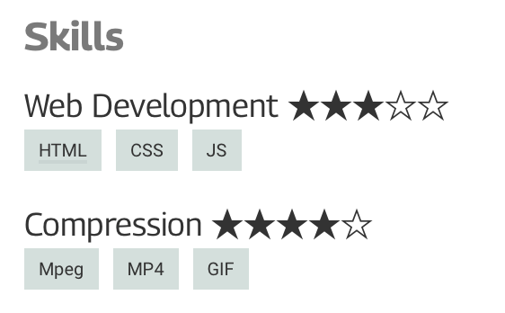

# JSONResume Lightweight Singlepage Theme

Theme for data in the [jsonresume.org](https://jsonresume.org) schema.
Focuses on single column designs which are [easier to parse](https://resources.workable.com/stories-and-insights/how-ATS-reads-resumes)
for some HR software. Plus it is less noisy for human eyes.
Inspired by the themes available on [standardresume.co](https://standardresume.co).

See the [boilerplate theme](https://www.npmjs.org/package/jsonresume-theme-boilerplate) for instructions.
## Features

 * HTML support in `summary` and `highlights`
 * CSS variables for easy colour adjustments
 * Relative font sizes with good print support
 * Optional profile picture
 * Nicer date formats (e.g. `Jan 2021`)
 * Skills with keywords and URLs (use `keywordsWithUrl`)
 * Star rating support for easy communication of skill level (e.g. `"level": "3/5"` turns into ★★★☆☆)

See `resume.sample.json` for more formatting hints.
## Preview

## License

Available under [the MIT license](http://mths.be/mit).
